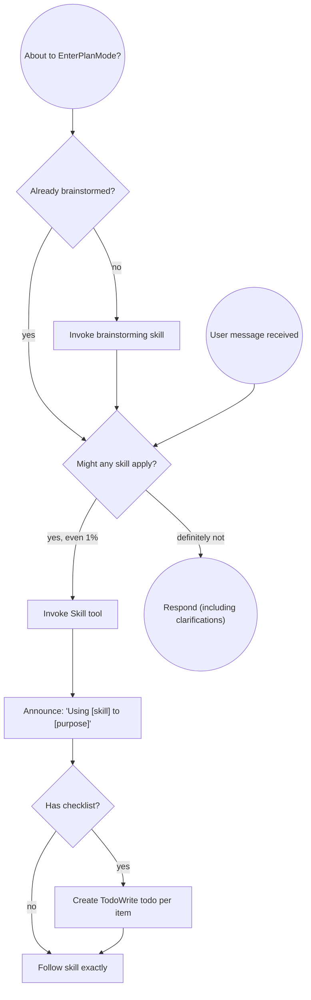

<SUBAGENT-STOP>
If you were dispatched as a subagent to execute a specific task, skip this skill.
</SUBAGENT-STOP>

<EXTREMELY-IMPORTANT>
If you think there is even a 1% chance a skill might apply to what you are doing, you ABSOLUTELY MUST invoke the skill.

IF A SKILL APPLIES TO YOUR TASK, YOU DO NOT HAVE A CHOICE. YOU MUST USE IT.

This is not negotiable. This is not optional. You cannot rationalize your way out of this.
</EXTREMELY-IMPORTANT>

## Instruction Priority

AIDD skills override default system prompt behavior, but **user instructions always take precedence**:

1. **User's explicit instructions** (CLAUDE.md, direct requests) — highest priority
2. **AIDD skills** — override default system behavior where they conflict
3. **Default system prompt** — lowest priority

If CLAUDE.md says "don't use TDD" and a skill says "always use TDD," follow the user's instructions. The user is in control.

## How to Access Skills

Use the `Skill` tool. When you invoke a skill, its content is loaded and presented to you — follow it directly. Never use the Read tool on skill files.

# Using Skills

## The Rule

**Invoke relevant or requested skills BEFORE any response or action.** Even a 1% chance a skill might apply means you should invoke the skill to check. If an invoked skill turns out to be wrong for the situation, you don't need to use it.



## Red Flags

These thoughts mean STOP — you're rationalizing:

| Thought | Reality |
|---------|---------|
| "This is just a simple question" | Questions are tasks. Check for skills. |
| "I need more context first" | Skill check comes BEFORE clarifying questions. |
| "Let me explore the codebase first" | Skills tell you HOW to explore. Check first. |
| "I can check git/files quickly" | Files lack conversation context. Check for skills. |
| "Let me gather information first" | Skills tell you HOW to gather information. |
| "This doesn't need a formal skill" | If a skill exists, use it. |
| "I remember this skill" | Skills evolve. Read current version. |
| "This doesn't count as a task" | Action = task. Check for skills. |
| "The skill is overkill" | Simple things become complex. Use it. |
| "I'll just do this one thing first" | Check BEFORE doing anything. |
| "This feels productive" | Undisciplined action wastes time. Skills prevent this. |
| "I know what that means" | Knowing the concept ≠ using the skill. Invoke it. |

## Skill Priority

When multiple skills could apply, use this order:

1. **Process skills first** (brainstorming, debugging) — these determine HOW to approach the task
2. **Implementation skills second** (code-generation, subagent-driven-development) — these guide execution

"Let's build X" → brainstorming first, then implementation skills.
"Fix this bug" → debugging first, then domain-specific skills.

## Skill Types

**Rigid** (TDD, verification): Follow exactly. Don't adapt away discipline.

**Flexible** (brainstorming, patterns): Adapt principles to context.

The skill itself tells you which.

## Audit Trail

Every AIDD session maintains an append-only audit log at `aidd-docs/audit.md`. This is **distinct** from the state file:

- `aidd-state.md` = progress tracking (phases, stages, completed/skipped)
- `audit.md` = complete interaction log (raw inputs, approvals, errors, changes)

### Audit Entry Format

```markdown
## [Stage Name] - [Action]
- **Timestamp**: YYYY-MM-DDTHH:MM:SSZ
- **User Input**: "[Complete raw user input - never summarized]"
- **AI Response**: "[AI's action or response]"
- **Context**: [Stage, action, decision]

---
```

### Audit Rules

- **Append-only**: Use Edit tool to append entries. NEVER use Write to overwrite audit.md
- **Never summarize user input**: Capture complete raw text exactly as provided
- **ISO 8601 timestamps**: Always use `YYYY-MM-DDTHH:MM:SSZ` format
- **Log at every approval point**: Before asking AND after receiving response
- **Log errors and resolutions**: Every error gets an audit entry
- **Created by workspace-detection**: First skill to run creates the file and logs the initial user request
- **Skills mark audit points with `<!-- AUDIT -->` comments**: Follow these markers in each skill

## Document Serial Numbers

All generated docs in `aidd-docs/` get a serial number prefix (e.g., `001-requirements.md`), **except** `aidd-state.md` and `audit.md`.

### Counter Location

The global counter is stored in `aidd-state.md` under `## Document Counter` → `**Next Doc ID**: 001`.

### Usage Pattern

Before creating any artifact file in `aidd-docs/`:

1. Read `**Next Doc ID**` from `aidd-state.md` under `## Document Counter`
2. Prefix the filename with the number: `{NNN}-original-name.md` (3-digit zero-padded)
3. After creating the file, increment `**Next Doc ID**` in `aidd-state.md` (e.g., `001` → `002`)
4. When reading artifacts from other skills, look up the actual prefixed filename from the directory

### Examples

- `001-architecture.md`, `002-code-structure.md`, `003-requirements.md`, etc.
- Construction artifacts: `010-{unit-name}-business-logic-model.md`

## Diagrams

All diagrams in AIDD-produced markdown **must use Mermaid** (fenced `mermaid` code blocks) — never Graphviz/`dot`, ASCII art, or images. See `diagram-style.md` for the full conventions (shapes, labels, colors) and when to prefer a table or list over a diagram.

# Phase → Skill Routing

## Inception

`workspace-detection` creates `aidd-docs/audit.md` and logs the initial user request (always first).

```
1. workspace-detection
   → brownfield? reverse-engineering : brainstorming
2. brainstorming
   → simple? writing-plans : requirements-analysis
3. requirements-analysis
   → user-stories OR application-design OR writing-plans
4. user-stories → application-design OR writing-plans
5. application-design → units-generation OR writing-plans
6. units-generation → per-unit construction
7. writing-plans
   → subagent-driven-development OR executing-plans
```

## Construction (per unit)

```
8. functional-design → nfr-design (if needed) → infrastructure-design (if needed)
9. code-generation (with TDD)
10. subagent-driven-development OR executing-plans
11. verification-before-completion (before ANY completion claim)
```

## Adaptive Depth

- **Simple fix**: brainstorming (minimal) → writing-plans → executing-plans → verification
- **Feature**: brainstorming → requirements-analysis → user-stories → writing-plans → subagent-driven → verification
- **Service/system**: full inception → application-design → units-generation → per-unit (functional-design → nfr-design → code-generation) → verification

## User Instructions

Instructions say WHAT, not HOW. "Add X" or "Fix Y" doesn't mean skip workflows.
