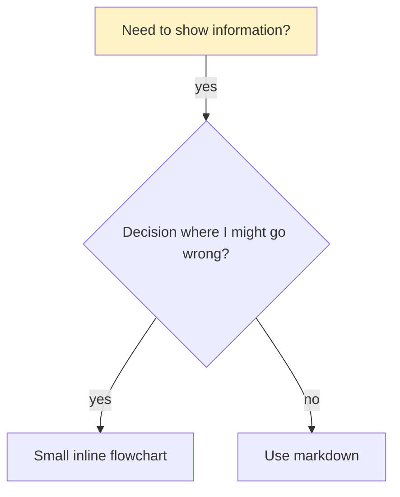

# Diagram Style Guide

> **The rule:** Every diagram in AIDD-produced markdown **must** use **Mermaid** inside a ` ```mermaid ` fenced block. Do **not** use Graphviz/`dot`, ASCII art, or images for diagrams.

## Why Mermaid

- **Renders natively** in GitHub, GitLab, IDEs, and Claude Code — no build step or external image.
- **Plain text** — diff-friendly, reviewable, version-controllable.
- **One consistent style** across every skill's output.

## When to draw a diagram (and when not to)

Reach for a `flowchart` **only** for:

- Non-obvious **decision points**
- **Process loops** where you might stop too early
- **"Use A vs B"** routing decisions

Prefer the simpler alternative otherwise:

| Content | Use instead of a diagram |
|---|---|
| Reference material | Tables, lists |
| Code examples | ` ``` ` code blocks |
| Linear instructions | Numbered lists |
| Labels with no semantic meaning | Don't diagram at all |

## Conventions

- **Direction:** `flowchart TD` (top-down, default) or `flowchart LR` (left-to-right). Equivalent to Graphviz `rankdir=TB` / `rankdir=LR`.
- **Node IDs:** use short stable IDs (`A`, `imp`, `more`); put the prose in the **label**, not the ID.
- **Quote labels** with `"..."` whenever they contain `?`, `:`, `/`, `(`, `)`, `,`, or brackets — both node text and edge text. Example: `A["User approves design?"]`, `B -->|"yes"| C`.
- **Line breaks** inside a label use `<br/>` (not `\n`).
- **Shapes:**

  | Meaning | Graphviz | Mermaid |
  |---|---|---|
  | box / step | `shape=box` | `[label]` |
  | decision | `shape=diamond` | `{label}` |
  | ellipse | `shape=ellipse` | `([label])` (stadium) |
  | terminal / doublecircle | `shape=doublecircle` | `((label))` (circle — Mermaid has no native double-circle) |
  | warning (octagon) | `shape=octagon` | `{{label}}` (hexagon) |

- **Colors:** `style <id> fill:#rrggbb` and optionally `color:#rrggbb` for text. Example: `style danger fill:#ff0000,color:#ffffff`.
- **Subgraphs:** Graphviz `subgraph cluster_X { label="..." }` → Mermaid `subgraph X ["..."] ... end`.

## Worked example


